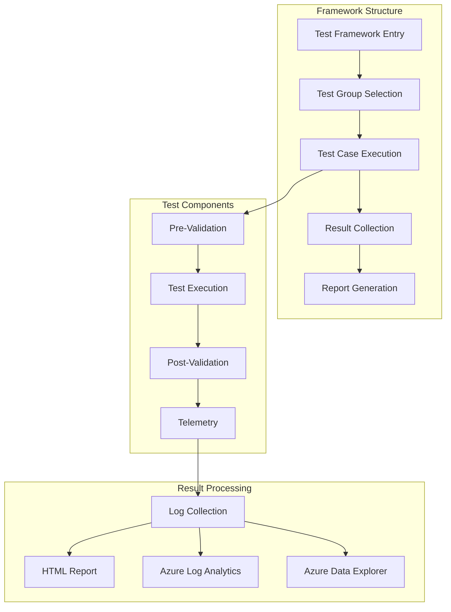
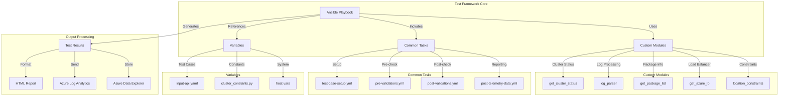
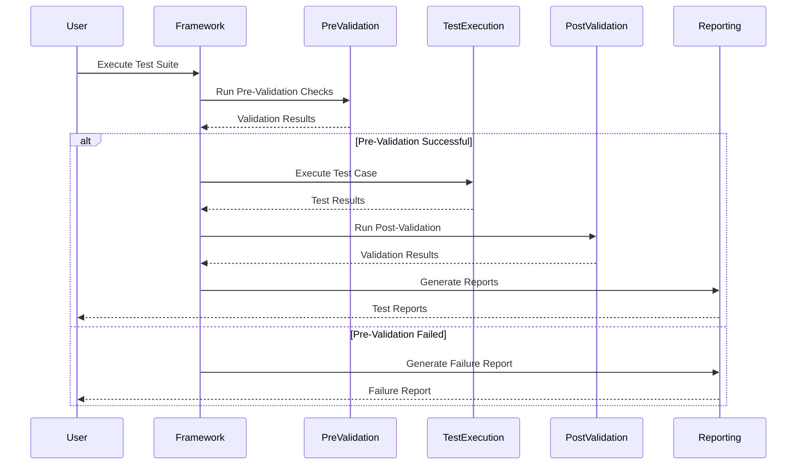
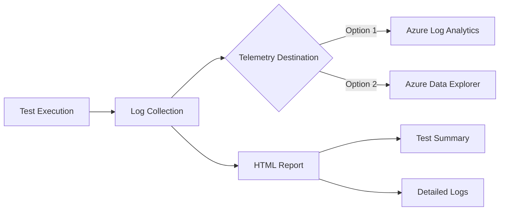

# SAP High Availability Testing Framework

## Overview

The SAP High Availability (HA) Testing Framework is an automated solution for validating high availability configurations of SAP systems on Azure. This framework provides comprehensive testing capabilities for:
- SAP HANA Database HA configurations
- SAP Central Services (SCS/ERS) HA setups

### Key Features
- Automated test execution
- Comprehensive validation checks
- Detailed HTML reporting
- Azure Log Analytics/Data Explorer integration
- Extensible test case framework

## Architecture

### High-Level Framework Structure



### Detailed Component Architecture



## Directory Structure
```
src/
├── module_utils/          # Shared utilities and constants
├── modules/              # Custom Ansible modules
├── roles/               # Test implementation roles
│   ├── ha_db_hana/     # HANA HA test cases
│   ├── ha_scs/         # SCS HA test cases
│   └── misc/           # Common tasks
├── templates/          # Report and configuration templates
└── vars/              # Framework configuration
```

## Test Execution Flow



## Getting Started

### Prerequisites
1. **SAP System on Azure**
   - Deployed SAP system with HA configuration
   - Network connectivity to test infrastructure

2. **Ubuntu Jump Host**
   - Ubuntu 22.04 LTS
   - System/User Assigned managed identity
   - Reader Role at subscription level

### Installation

1. Clone the repository:
```bash
git clone https://github.com/devanshjainms/sap-automation-qa.git
cd sap-automation-qa
```

2. Run setup script:
```bash
./scripts/setup.sh
```

### Configuration

1. Update `vars.yaml` with test parameters:
```yaml
TEST_TYPE: "SAPFunctionalTests"
sap_functional_test_type: "DatabaseHighAvailability"  # or "CentralServicesHighAvailability"
SYSTEM_CONFIG_NAME: "YOUR-SYSTEM-NAME"
```

2. Configure system workspace in `WORKSPACES/SYSTEM/`

### Test Execution

Run the framework:
```bash
./scripts/sap_automation_qa.sh
```

## Writing New Test Cases

### Test Case Structure
```yaml
- name: "Test Case Name"
  block:
    # 1. Test Setup
    - name: "Test Setup Tasks"
      include_tasks: "roles/misc/tasks/test-case-setup.yml"

    # 2. Pre-Validation
    - name: "Pre Validations"
      # Verify initial state

    # 3. Test Execution
    - name: "Test Execution"
      block:
        # Main test logic
      rescue:
        # Error handling

    # 4. Post-Validation
    - name: "Post Validations"
      include_tasks: "roles/misc/tasks/post-validations.yml"
```

### Development Process

1. **Planning**
   - Define test objectives
   - Identify validations
   - Determine success criteria
   - Plan cleanup procedures

2. **Implementation**
   - Create task file in appropriate role
   - Follow standard structure
   - Implement error handling
   - Add comprehensive logging

3. **Registration**
   - Add test case to `vars/input-api.yaml`

## Test Result Processing



## Best Practices

1. **Test Development**
   - Maintain idempotency
   - Implement proper cleanup
   - Include comprehensive logging
   - Add proper validations

2. **Error Handling**
   - Use rescue blocks
   - Clean up resources
   - Provide detailed messages

3. **Validation**
   - Check prerequisites
   - Verify post-test state
   - Monitor side effects

## Troubleshooting

### Common Issues
1. Connection failures
   - Check network connectivity
   - Verify credentials
   - Validate permissions

2. Test failures
   - Review test logs
   - Check system state
   - Verify prerequisites

### Debug Methods
1. Check ansible logs
2. Review system logs
3. Verify test prerequisites

### Recovery Procedures
1. Manual cleanup steps
2. State verification
3. Resource reset

## License

Copyright (c) Microsoft Corporation.
Licensed under the MIT License.

## Support

For support and questions, please:
1. Check existing issues
2. Create new issue if needed
3. Provide detailed information about the problem

## Additional Resources
- [Azure SAP Documentation](https://docs.microsoft.com/azure/sap)
- [SAP on Azure: High Availability Guide](https://docs.microsoft.com/azure/sap/workloads/sap-high-availability-guide-start)

## Contributing

This project welcomes contributions and suggestions.  Most contributions require you to agree to a
Contributor License Agreement (CLA) declaring that you have the right to, and actually do, grant us
the rights to use your contribution. For details, visit https://cla.opensource.microsoft.com.

When you submit a pull request, a CLA bot will automatically determine whether you need to provide
a CLA and decorate the PR appropriately (e.g., status check, comment). Simply follow the instructions
provided by the bot. You will only need to do this once across all repos using our CLA.

This project has adopted the [Microsoft Open Source Code of Conduct](https://opensource.microsoft.com/codeofconduct/).
For more information see the [Code of Conduct FAQ](https://opensource.microsoft.com/codeofconduct/faq/) or
contact [opencode@microsoft.com](mailto:opencode@microsoft.com) with any additional questions or comments.

## Trademarks

This project may contain trademarks or logos for projects, products, or services. Authorized use of Microsoft 
trademarks or logos is subject to and must follow 
[Microsoft's Trademark & Brand Guidelines](https://www.microsoft.com/en-us/legal/intellectualproperty/trademarks/usage/general).
Use of Microsoft trademarks or logos in modified versions of this project must not cause confusion or imply Microsoft sponsorship.
Any use of third-party trademarks or logos are subject to those third-party's policies.
